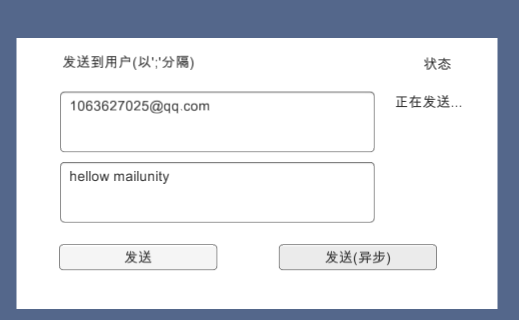

# MailUnity
mail system for unity,support send mail
learn from [Mail](https://github.com/mafly/Mail)

###and simplfy interface:
```
   public interface IMail
    {
        IMail AddReceivers(string receiverName, params string[] addresses);//添加接收人
        IMail AddSubReceivers(params string[] addresses);//添加抄送
        IMail AddSubject(string subject);//添加主题
        IMail AddFiles(params string[] files);//添加文件
        IMail AddAttachment(params Attachment[] files);//添加文件
        IResult Send(string body);
    }
```
### and a simple demo

